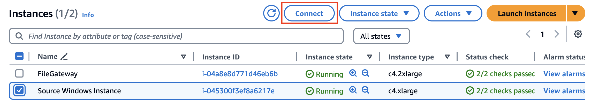
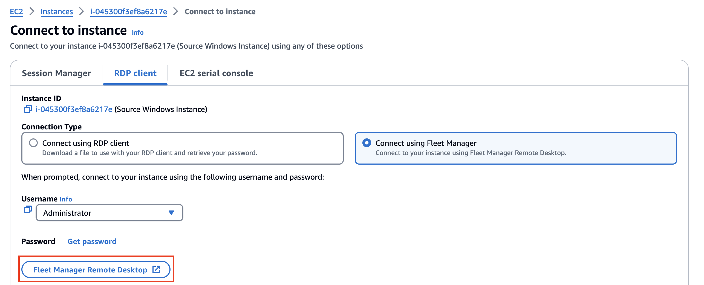
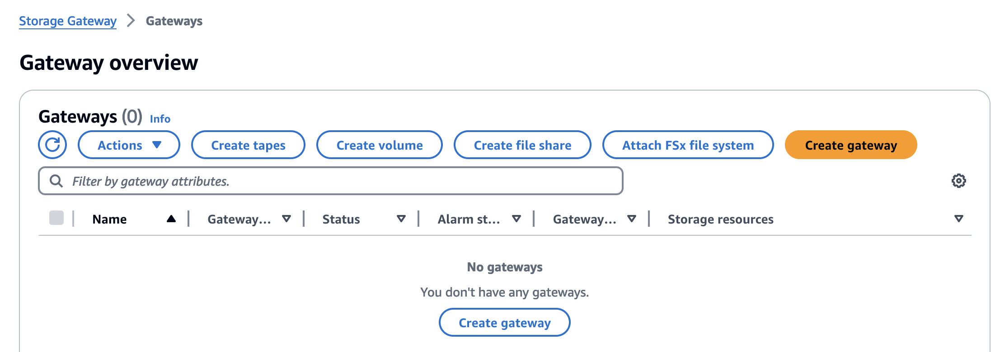
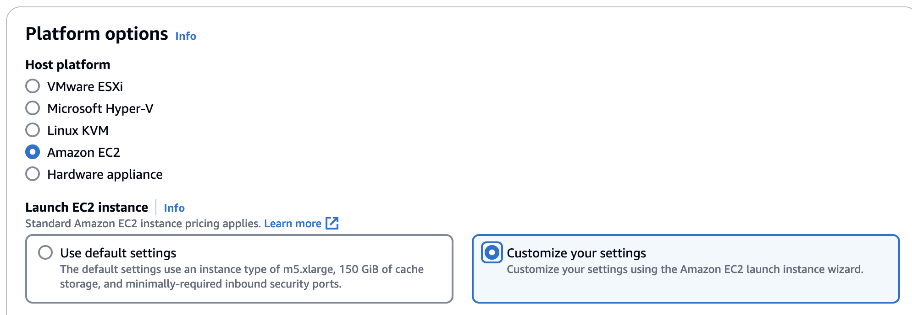
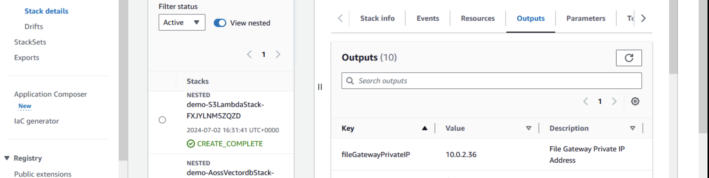
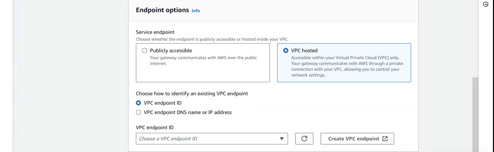
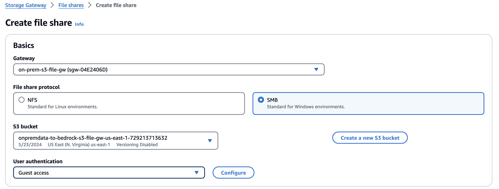
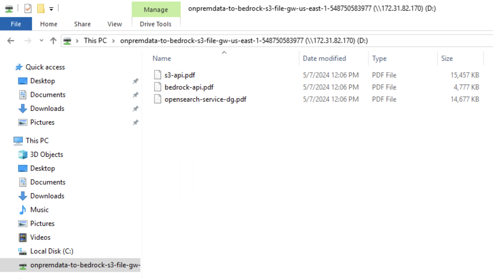

### Amazon S3 File Gateway Deployment Steps

#### Step1: RDP into the Window instance and create an S3 File Gateway 

- From the Amazon EC2 console, select the instance labeled "Source Windows Instance" and click "Connect." 



- Select "RDP client" as the connection type and choose "Connect using Fleet Manager." 
- Click "Fleet Manager Remote Desktop" and select your Key pair. This will launch your Windows UI in a new browser tab.



- Open a browser and log into your AWS account using your credentials

- In your AWS console, search for "Storage Gateway" and select "Create gateway."



- Give your gateway an unique name and verify that "Amazon S3 File Gateway" is selected as the gateway type.
- Select "Amazon EC2" as the host platform. *Note This is for the purpose of simulating an on premises deployment. For production deployments, a supported virtual machine or hardware appliance will be used. 
- Select "Customize your settings" and check the box to confirm your setup.
- Click next. 



- Open a separate browser tab and navigate to the CloudFormation Nested Stack for Infrastructure and copy the fileGatewayPrivateIP value from the "Outputs" tab.



- Paste the IP Address of the File Gateway Instance into the "IP address" box and click next.


- Select "VPC hosted" as the service endpoint and select the VPC endpoint ID available in the dropdown.   



- Complete the steps on the following 2 screens to configure the gateway using the default options and click "Configure gateway."

#### Step2: Create an SMB File Share

- With your File Gateway deployed, click "Create file share." 
- Select your new gateway and choose "SMB" as the file share protocol and the S3 bucket beginning with the label "onpremdata-to-bedrock-S3-file-gw." 
- Select "Guest access" as the user authenticaton and create a password. 
- Click "Create file share."



#### Step3: Mount the file share to the Windows instance and copy files into S3.

- Open a Windows command promt (cmd) to mount the file share by copying the command below (replacing the bracketed values with the correct values shown in the "Example Commands" section at the bottom of the file share page in the AWS console.) 

```bash
net use [WindowsDriveLetter]: \\[fileshare_IP_address]\onpremdata-to-bedrock-s3-file-gw-[AWS_Region]-[AWS_AccountId]
```

- When prompted, enter the username: "smbguest" and the password you chose when creating the file share.
- Select the file share from Windows Explorer and copy the 3 PDF files from the desktop into the share.



#### Step4: Return to the web application and verify that the files now appear in the drop-down menu. 

Allow several minutes for the knowledge base to update and then resume asking questions.

